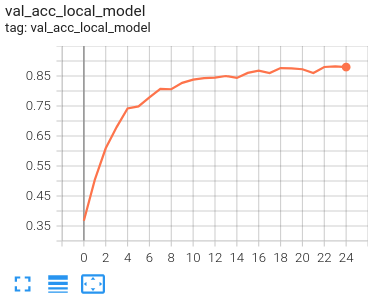
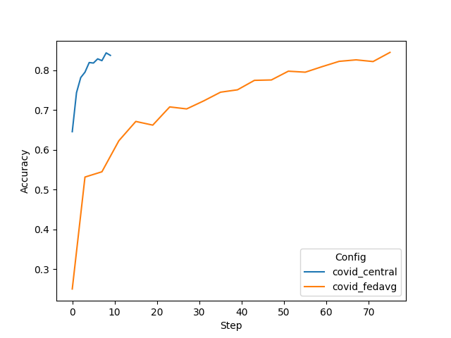
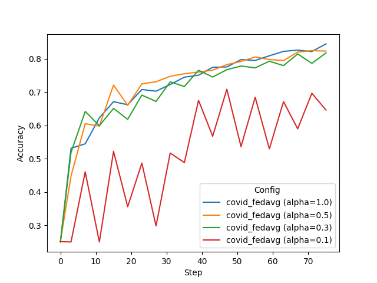

# Simulated Federated Learning with COVID

This example includes instructions on running [FedAvg](https://arxiv.org/abs/1602.05629) algorithms using NVFlare's FL simulator.

All the following command should be executed under `covid-sim` subfolder.

## 1. Set up a virtual environment
```
python3 -m pip install --user --upgrade pip
python3 -m pip install --user virtualenv
```
(If needed) make all shell scripts executable using
```
find . -name ".sh" -exec chmod +x {} \;
```
initialize virtual environment.
```
source ./virtualenv/set_env.sh
```
install required packages for training
```
pip install --upgrade pip
pip install -r ./virtualenv/min-requirements.txt
```
(optional) if you would like to plot the TensorBoard event files as shown below, please also install
```
pip install -r ./virtualenv/plot-requirements.txt
```
Set `PYTHONPATH` to include custom files of this example:
```
export PYTHONPATH=${PWD}/..
export COVID_ROOT=${PWD}/../data
```

### 2. Download the COVID dataset 

If you are using EC2, download the dataset from S3:

```
# Run command under the root directory of this repo.
aws s3 sync s3://capstone-fed-learn/data/lung_classification/ data/
```

## 3. Run simulated FL experiments

We are using NVFlare's [FL simulator](https://nvflare.readthedocs.io/en/latest/user_guide/fl_simulator.html) to run the following experiments. 

First set the output root where to save the results
```
export RESULT_ROOT=/tmp/nvflare/sim_covid
```

### 3.1 Varying data heterogeneity of data splits

We use an implementation to generated heterogeneous data splits from CIFAR-10 based a Dirichlet sampling strategy 
from FedMA (https://github.com/IBM/FedMA), where `alpha` controls the amount of heterogeneity, 
see [Wang et al.](https://arxiv.org/abs/2002.06440).

We use `set_alpha.sh` to change the alpha value inside the job configurations.

### 3.2 Centralized training

To simulate a centralized training baseline, we run FL with 1 client for 20 local epochs but only for one round. 
It takes circa 6 minutes on an NVIDIA TitanX GPU.
```
./set_alpha.sh covid_central 0.0
nvflare simulator job_configs/covid_central --workspace ${RESULT_ROOT}/central --threads 1 --n_clients 1
```
Note, here `alpha=0.0` means that no heterogeneous data splits are being generated.

You can visualize the training progress by running `tensorboard --logdir=${RESULT_ROOT}`


### 3.3 FedAvg on different data splits

FedAvg (8 clients). Here we run for 40 rounds, with 4 local epochs. Corresponding roughly 
to the same number of iterations across clients as in the central baseline above (40*4 divided by 8 clients is 20):
Each job will take about 35 minutes, depending on your system. 

You can copy the whole block into the terminal, and it will execute each experiment one after the other.
```
./set_alpha.sh covid_fedavg 1.0
nvflare simulator job_configs/covid_fedavg --workspace ${RESULT_ROOT}/fedavg_alpha1.0 --threads 8 --n_clients 8
./set_alpha.sh covid_fedavg 0.5
nvflare simulator job_configs/covid_fedavg --workspace ${RESULT_ROOT}/fedavg_alpha0.5 --threads 8 --n_clients 8
./set_alpha.sh covid_fedavg 0.3
nvflare simulator job_configs/covid_fedavg --workspace ${RESULT_ROOT}/fedavg_alpha0.3 --threads 8 --n_clients 8
./set_alpha.sh covid_fedavg 0.1
nvflare simulator job_configs/covid_fedavg --workspace ${RESULT_ROOT}/fedavg_alpha0.1 --threads 8 --n_clients 8
```

## 4. Results

Let's summarize the result of the experiments run above. First, we will compare the final validation scores of 
the global models for different settings. In this example, all clients compute their validation scores using the
same CIFAR-10 test set. The plotting script used for the below graphs is in 
[./figs/plot_tensorboard_events.py](./covid-sim/figs/plot_tensorboard_events.py) 
(please install [./virtualenv/plot-requirements.txt](./covid-sim/virtualenv/plot-requirements.txt)).

### 4.1 Central vs. FedAvg
With a data split using `alpha=1.0`, i.e. a non-heterogeneous split, we achieve the following final validation scores.
One can see that FedAvg can achieve similar performance to central training.

| Config	| Alpha	| 	Val score	| 
| ----------- | ----------- |  ----------- |
| covid_central | 1.0	| 	0.83700	| 
| covid_fedavg  | 1.0	| 	0.82425	| 



### 4.2 Impact of client data heterogeneity

We also tried different `alpha` values, where lower values cause higher heterogeneity. 
This can be observed in the resulting performance of the FedAvg algorithms.  

| Config |	Alpha |	Val score |
| ----------- | ----------- |  ----------- |
| covid_fedavg |	1.0 |	0.82425 |
| covid_fedavg |	0.5 |	0.83100 |
| covid_fedavg |	0.3 |	0.78450 |
| covid_fedavg |	0.1 |	0.74150 |


